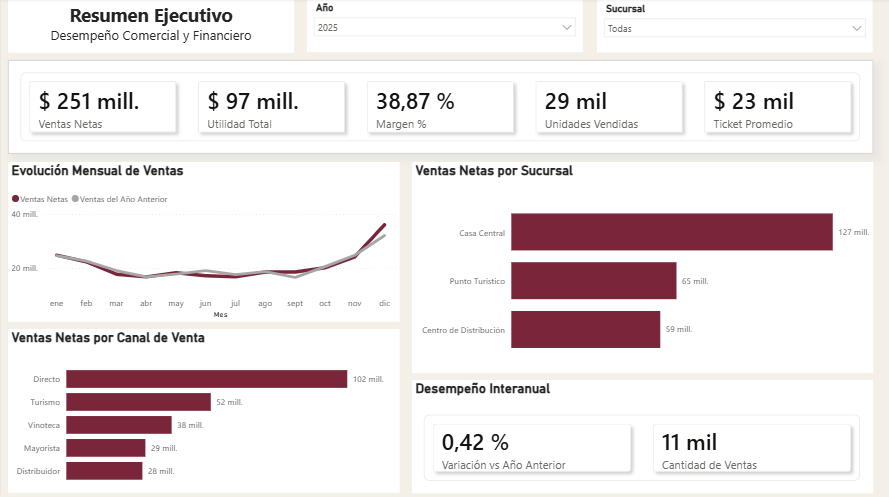
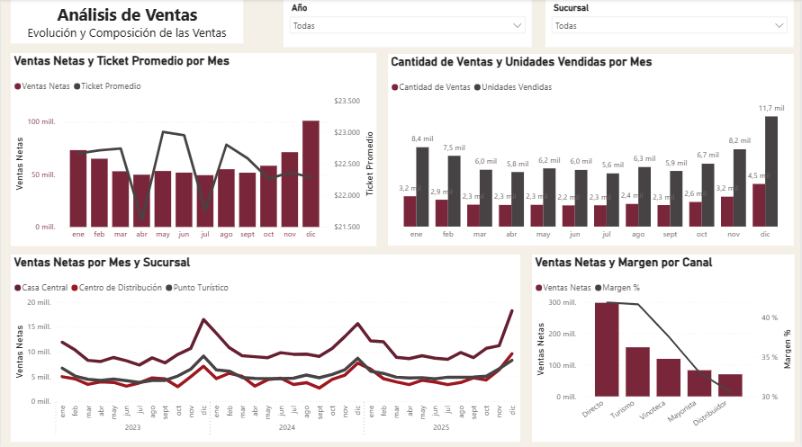
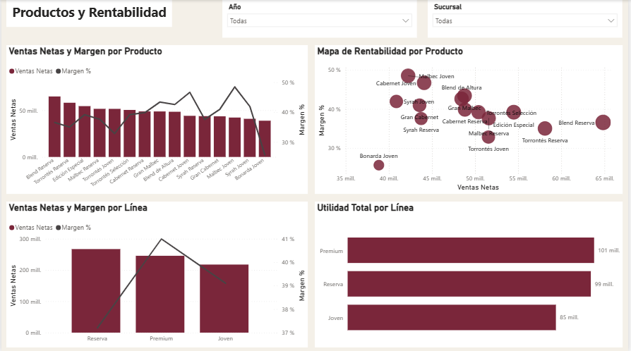
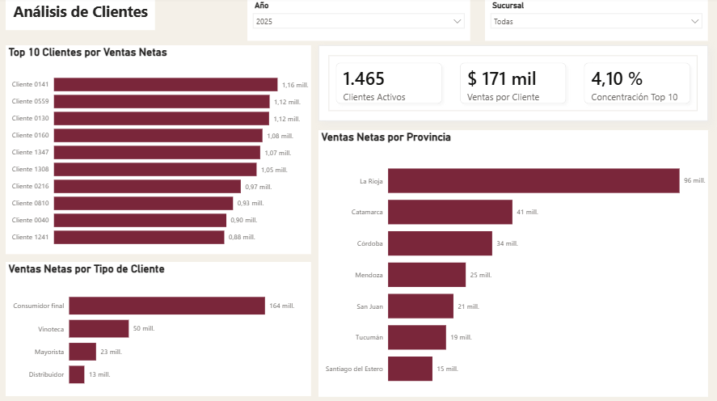
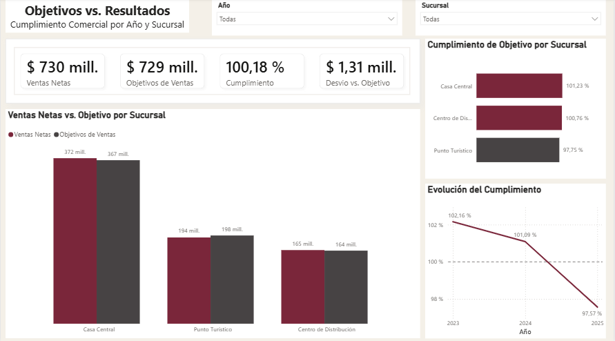

# 🍷 Bodega Chilecito | Business Intelligence

Proyecto integral de Business Intelligence desarrollado como caso de estudio a partir de datos simulados del sector vitivinícola.

El objetivo fue transformar registros comerciales en una solución de análisis que permitiera evaluar el desempeño de ventas, rentabilidad, clientes y cumplimiento de objetivos.

## 🎯 Objetivo del proyecto

Desarrollar una solución de Business Intelligence de punta a punta, abarcando desde la limpieza y transformación de los datos hasta la construcción de un dashboard interactivo orientado a la toma de decisiones.

## 🛠️ Herramientas utilizadas

- Excel
- Power Query
- Power BI
- DAX

## 🔄 Proceso

El proyecto comprendió las siguientes etapas:

1. Limpieza, transformación y validación de los datos.
2. Recuperación de valores faltantes mediante reglas de negocio.
3. Construcción de un modelo dimensional en esquema estrella.
4. Desarrollo de medidas e indicadores mediante DAX.
5. Incorporación de objetivos comerciales anuales por sucursal.
6. Diseño de un dashboard interactivo en Power BI.
7. Análisis de resultados y elaboración de recomendaciones.

## 📊 Dashboard

El dashboard se estructuró en cinco páginas:

- **Resumen Ejecutivo:** principales indicadores comerciales y financieros.
- **Análisis de Ventas:** evolución temporal, volumen, sucursales y canales.
- **Productos y Rentabilidad:** análisis conjunto de ventas, margen y utilidad.
- **Análisis de Clientes:** concentración, tipología y distribución geográfica.
- **Objetivos vs. Resultados:** seguimiento del cumplimiento comercial.

  ### Resumen Ejecutivo

### Análisis de Ventas

### Productos y Rentabilidad

### Análisis de Clientes

### Objetivos vs. Resultados

## 🔎 Principales hallazgos

- Las ventas netas crecieron **8,63 % en 2024**, pero el crecimiento se desaceleró hasta **0,42 % en 2025**.
- Diciembre presenta el principal pico estacional de ventas, explicado principalmente por un aumento de las operaciones y unidades vendidas.
- Una mayor facturación no implica necesariamente una mayor rentabilidad: existen diferencias relevantes entre productos, líneas y canales.
- El cumplimiento acumulado de objetivos alcanzó **100,18 %**, aunque la evolución anual muestra un deterioro hasta ubicarse por debajo del objetivo en 2025.
- El análisis por sucursal evidencia comportamientos diferentes que pueden quedar ocultos al observar únicamente los resultados agregados.

## 🗂️ Modelo de datos

Se desarrolló un modelo dimensional en esquema estrella, integrando la tabla de hechos de ventas con dimensiones de clientes, productos, empleados, sucursales y calendario.

Los objetivos comerciales fueron incorporados respetando su granularidad anual para evitar comparaciones mensuales no respaldadas por los datos de origen.

## 📄 Documentación

El repositorio incluye la documentación completa del proyecto, donde se detallan las decisiones de limpieza, transformación, modelado, construcción de indicadores, diseño del dashboard y análisis de resultados.
➡️ [Ver documentación completa del proyecto](Bodega_Chilecito_Documentacion.pdf)

## ℹ️ Sobre los datos

Este proyecto fue desarrollado como **caso de estudio utilizando datos simulados**, buscando reproducir un escenario comercial realista del sector vitivinícola.
